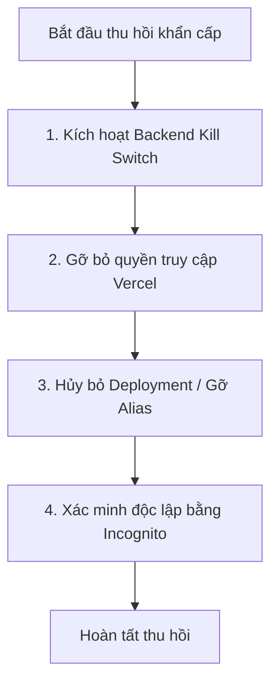

# RUNBOOK THU HỒI QUYỀN TRUY CẬP BẢN DEMO (DEMO ACCESS REVOCATION RUNBOOK)

> **Mục đích:** Hướng dẫn vận hành tiêu chuẩn cho Senior DevOps / Security Engineer để thu hồi toàn bộ quyền truy cập của khách hàng đối với bản dùng thử (Demo Deployment) ngay lập tức khi hết thời hạn hoặc khách không hoàn tất nghĩa vụ thanh toán.
> **Quy tắc bất khả xâm phạm:** Không xóa deployment bằng wildcard. Mọi thao tác phải sử dụng định danh chính xác (Deployment ID, User Email).

---

## 1. THÔNG TIN ĐỊNH DANH PHIÊN DEMO

| Tham số | Giá trị thực tế / Quy định |
| :--- | :--- |
| **Vercel Project** | `exam` (`prj_VAY1rRueUExvUnM1OylMN8oVguqz`) |
| **Vercel Team / Account** | `windowgamer11-7579s-projects` (`triplen01`) |
| **Khách hàng thử nghiệm** | `[EMAIL_KHÁCH]` (Cần cung cấp trước khi kích hoạt phân quyền) |
| **Thời hạn demo cam kết** | 48 giờ kể từ thời điểm cấp quyền |
| **Chế độ triển khai** | Preview Deployment (Không dùng Production) |

---

## 2. QUY TRÌNH THU HỒI THÔNG THƯỜNG (STANDARD REVOCATION)
*Áp dụng khi kết thúc 48h demo mà chưa ký kết hợp đồng, hoặc theo yêu cầu hành chính.*

### Bước 1: Xóa quyền truy cập của khách trên Vercel
1. Truy cập **Vercel Dashboard** -> Chọn Project `exam` -> **Settings** -> **Deployment Protection**.
2. Tại mục **Vercel Authentication** / **Protected Environments**:
   - Nếu sử dụng External User: Tìm email `[EMAIL_KHÁCH]` trong danh sách ủy quyền và nhấn **Remove Access**.
   - Nếu sử dụng Password Protection: Nhấn **Change Password** hoặc **Disable** để vô hiệu hóa mật khẩu đã cấp cho khách.
3. Nhấn **Save**.

### Bước 2: Vô hiệu hóa phiên Backend (Nếu có kết nối Backend)
1. Tại máy chủ hoặc workstation quản lý backend:
   ```bash
   # Nếu backend sử dụng cờ DEMO_ENABLED:
   export DEMO_ENABLED=false
   # Hoặc revoke token phiên của khách trong cơ sở dữ liệu xác thực
   ```
2. Thu hồi demo session ID tương ứng.

### Bước 3: Đóng kết nối mạng ngoại vi (Cloudflare Tunnel nếu có)
1. Nếu mở luồng demo qua Cloudflare Named Tunnel:
   ```bash
   # Dừng tiến trình cloudflared tunnel
   cloudflared tunnel route dns -d demo-exam.domain.com
   # Hoặc dừng service tunnel
   pkill cloudflared
   ```

### Bước 4: Kiểm tra xác minh thu hồi
1. Mở cửa sổ ẩn danh trình duyệt (Incognito / Private Browsing).
2. Truy cập URL Preview Deployment của Vercel:
   - **Kỳ vọng:** Trình duyệt chuyển hướng về trang đăng nhập Vercel Authentication hoặc hiển thị màn hình `401 / 403 Forbidden` / `Authentication Required`.
3. Gọi thử endpoint backend (nếu có):
   - **Kỳ vọng:** Trả về `401 Unauthorized` hoặc kết nối bị từ chối (`Connection Refused`).

### Bước 5: Ghi nhật ký bằng chứng thu hồi
1. Chụp ảnh màn hình cửa sổ ẩn danh bị chặn truy cập.
2. Lưu timestamp thu hồi vào biên bản nghiệm thu kỹ thuật nội bộ.

---

## 3. QUY TRÌNH THU HỒI KHẨN CẤP (EMERGENCY KILL SWITCH)
*Áp dụng khi phát hiện hành vi xâm phạm, sao chép trái phép, hoặc khách từ chối thanh toán và có nguy cơ rò rỉ (Hoàn thành trong < 2 phút).*



### Thao tác 1: Kích hoạt Backend Kill Switch (Tức thì)
Nếu backend đang mở qua tunnel hoặc reverse proxy:
- Lập tức ngắt tiến trình tunnel hoặc đóng cổng firewall:
  ```powershell
  # Trên Windows PowerShell quản lý:
  Stop-Process -Name "cloudflared" -Force -ErrorAction SilentlyContinue
  ```

### Thao tác 2: Thu hồi quyền truy cập Vercel của khách
- Đổi ngay mật mã bảo vệ hoặc chuyển trạng thái Deployment Protection sang chế độ `Team Only`:
  1. Vercel Project -> **Settings** -> **Deployment Protection**.
  2. Bật `Standard Protection: Only members of your Vercel Team`.
  3. Nhấn **Save**.

### Thao tác 3: Tắt Deployment / Gỡ Alias cụ thể
*(Lưu ý: Không dùng wildcard `*`. Chỉ thao tác trên đúng Deployment ID của phiên demo)*
1. Tra cứu chính xác deployment ID của bản demo:
   ```bash
   npx vercel ls exam
   ```
2. Gỡ bỏ alias của bản demo hoặc xóa deployment ID cụ thể (ví dụ `dpl_xxxxxxxxxxxx`):
   ```bash
   # LỆNH YÊU CẦU XÁC NHẬN CHÍNH XÁC ID TRƯỚC KHI CHẠY:
   npx vercel rm <DEPLOYMENT_ID_CỤ_THỂ> --yes
   ```

### Thao tác 4: Xác minh độc lập
1. Kiểm tra bằng lệnh curl hoặc urllib:
   ```bash
   python -c "import urllib.request; urllib.request.urlopen('<URL_DEMO>')"
   ```
2. Đảm bảo phản hồi là `401 / 403 / 404`, không còn khả năng tải giao diện hoặc tương tác.
